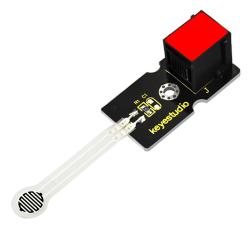
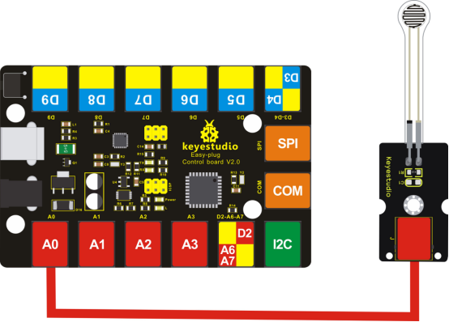
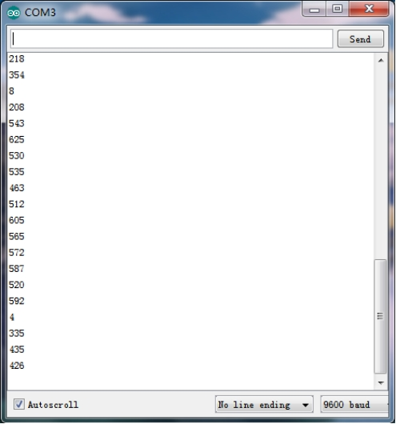

# KS0371 EASY plug Thin-film Pressure Sensor (Black and Eco-friendly)



## 1. Introduction

This EASY plug pressure sensor adopts the flexible Nano pressure-sensitive material with an ultra-thin film pad. It has the functions of water-proof and pressure detection. The force sensors are ultra-thin and flexible printed circuits, which can be easily integrated into force measurement applications.

The harder you press, the lower the sensor's resistance.

When the sensor detects the outside pressure, the resistance of sensor will make a change. So we can use the circuit to convert the pressure signal that senses pressure change into the corresponding electric signal output.

In this way, we can know the conditions of pressure changes by detecting the signal changes. You can connect the sensor to EASY plug Control board for communication using only a RJ11 cable.

**Special Note:**

The sensor/module is equipped with the RJ11 6P6C interface, compatible with our keyestudio EASY plug Control Board with RJ11 6P6C interface.

If you have the control board of other brands, it is also equipped with the RJ11 6P6C interface but has different internal line sequence, can’t be used compatibly with our sensor/module.

## 2. Parameters

- Working Voltage: DC 3.3V—5V
- Range: 0-0.5KG
- Thickness: ＜0.25mm
- Response Point: ＜20g
- Repeatability: ＜±5.8%（50% load）
- Accuracy: ±2.5%（85% range interval）
- Durability: ＞100 thousand times
- Initial Resistance: ＞100MΩ (no load)
- Response Time: ＜1ms
- Recovery Time: ＜15ms
- Working Temperature: -20℃ to 60℃

## 3. Technical Details

- Dimensions: 80mm * 20mm * 18mm
- Weight: 4.4g

## 4. Connect It Up

Connect the EASY Plug Pressure sensor to control board using an RJ11 cable. Then connect the control board to your PC with a USB cable.



## 5. Upload the Code

Download code:  [Code](./Code.7z)

```c
int s_pin = A0;

void setup()
{
  Serial.begin(9600);
  pinMode(s_pin,INPUT);
}

void loop() 
{
  Serial.println(analogRead(s_pin));
  delay(500);
}
```

## 6. Result

After uploading the code, open the serial monitor in the Arduino IDE and set the baud rate to 9600. When press tightly the sensor’s pad, you should see the value become larger. So the sensor works normally.

